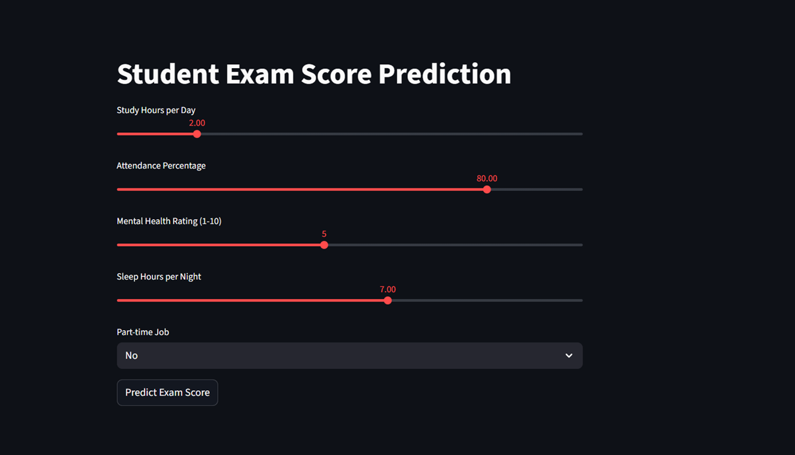
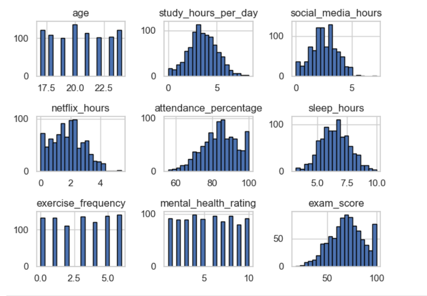
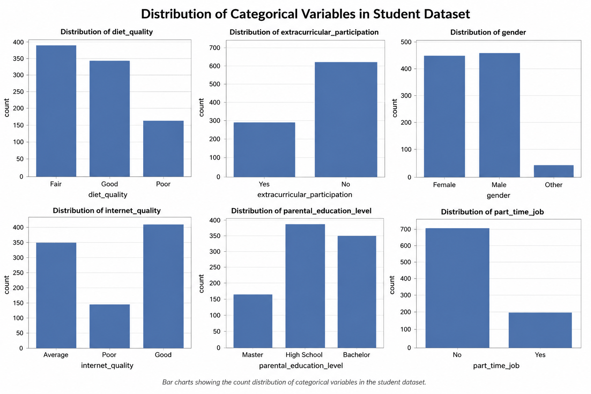
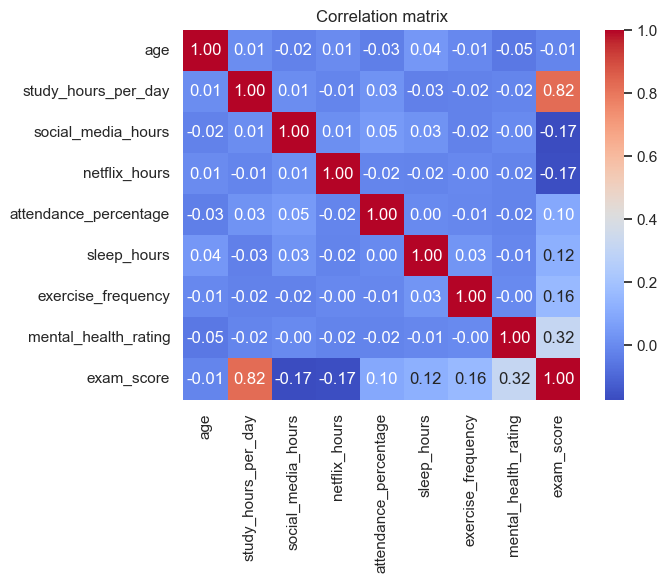
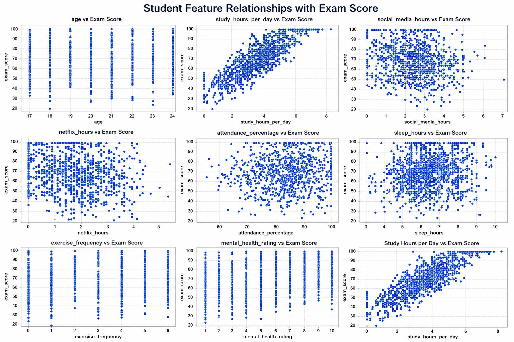
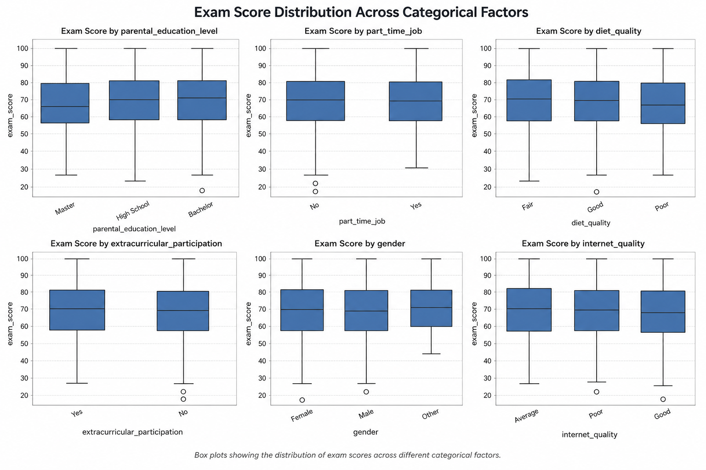
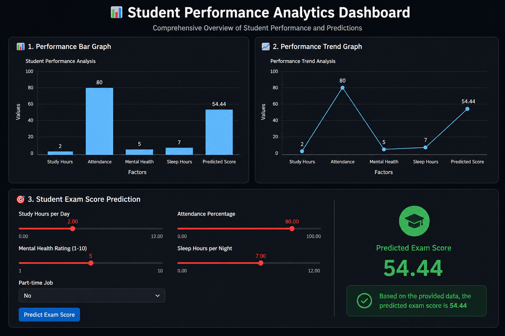

# 🎓 Student Exam Score Prediction System


<p align="left">
  A Machine Learning based web application that predicts student exam scores using academic and lifestyle factors.
</p>

<p align="center">


</p>

---

# 📌 About The Project

The **Student Exam Score Prediction System** is a Machine Learning project that predicts student performance based on different factors such as:

* 📚 Study Hours
* 🏫 Attendance Percentage
* 🧠 Mental Health Rating
* 😴 Sleep Hours
* 💼 Part-Time Job Status

This project uses a trained Machine Learning model with a **Streamlit dashboard** for real-time predictions.

---

# 📑 Table of Contents

* [✨ Features](#-features)
* [🛠️ Tech Stack](#️-tech-stack)
* [📂 Dataset](#-dataset)
* [📸 Screenshots](#-screenshots)
* [⚙️ Installation](#️-installation)
* [🚀 Usage](#-usage)
* [📁 Project Structure](#-project-structure)
* [📊 Results](#-results)
* [🔮 Future Improvements](#-future-improvements)
* [🤝 Contribution](#-contribution)
* [👨‍💻 Author](#-author)
* [📜 License](#-license)

---

# ✨ Features

* Real-time Student Score Prediction
* Interactive Streamlit Dashboard
* Machine Learning Integration
* User-Friendly Interface
* Fast Prediction System

---

# 🛠️ Tech Stack

| Technology   | Purpose              |
| ------------ | -------------------- |
| Python       | Programming Language |
| Streamlit    | Web Framework        |
| Scikit-learn | Machine Learning     |
| Pandas       | Data Handling        |
| NumPy        | Numerical Operations |
| Joblib       | Model Saving         |

---

# 📂 Dataset

The dataset contains student-related information such as:

* Study Hours
* Attendance
* Sleep Hours
* Mental Health Rating
* Part-Time Job Status
* Exam Score

---

# 📸 Screenshots

## 🖥️ Dashboard Screenshot



---

## 📈 Graph / Visualization Output











---

## 🤖 Prediction Output
<br>




---

# ⚙️ Installation

## 1️⃣ Clone Repository

```bash
git clone https://github.com/29tarunchahar/student-exam-score-prediction.git
```

---

## 2️⃣ Move to Project Folder

```bash
cd student-exam-score-prediction
```

---

## 3️⃣ Install Required Libraries

```bash
pip install -r requirements.txt
```

---

# 🚀 Usage

## ▶️ Run Streamlit App

```bash
streamlit run predicting_student_exam_score.py
```

---

# 📁 Project Structure

```bash
student-exam-score-prediction/
│
├── .vscode/
│
├── images/
│   │
│   ├── dashboard/
│   │   └── dashboard.png
│   │
│   ├── graph_visulation/
│   │   │
│   │   ├── boxplot/
│   │   │   └── exam_score_distribution_across_categorical_factors.png
│   │   │
│   │   ├── countplot/
│   │   │   └── distribution_of_student_dataset_variables.png
│   │   │
│   │   ├── heatmap/
│   │   │   └── correlation_matrix.png
│   │   │
│   │   ├── histogram/
│   │   │   └── tight_layout.png
│   │   │
│   │   └── scatter_plot/
│   │       └── student_feature_relationships_with_exam_scores.png
│   │
│   └── predication_graphs/
│       └── student_performance_analytics_dashboard.png
│
├── final_model.pkl
├── notebook.ipynb
├── predicting_student_exam_score.py
├── README.md
└── student_habits_performance.csv
```


---


# 👨‍💻 Author

## Tarun Chahar

* 🎓 B.Tech CSE Student
* 💻 Aspiring Data Scientist
* 🚀 Passionate about Machine Learning & AI

### 📬 Connect With Me

* GitHub: https://github.com/29tarunchahar
* LinkedIn: https://www.linkedin.com/in/29-tarun-chahar/

---


<h3 align="center">💖 Thank You for Visiting 💖</h3>
